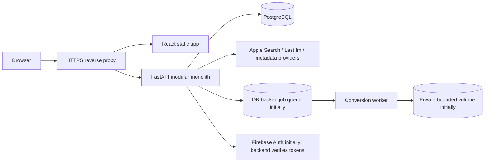

# 2. Architecture and decisions

## Initial shape: modular monolith
Build one React app, one FastAPI app with explicit domain modules, PostgreSQL, and a separately invokable conversion worker. Run locally with Docker Compose. First Lightsail deployment is a single Linux VM running Compose behind a reverse proxy. This is simple to learn and gives later extraction seams; it is one failure domain, not high availability.

Logical modules: identity, catalog, search, playlists, discovery, reviews, jobs, media, admin. Modules communicate through Python application interfaces, not cross-module imports of every model. Keep one initial relational DB but assign table ownership.

## Why not microservices now?
Each deployed service adds contracts, network failure, inter-service auth, deployments, logs/health checks, version compatibility and operations. For a tiny team and ~100 known users, that burden is unlikely to pay back. Conversion is the first separate process because resource profile/failure behavior differ. Extract others only when measured scaling, reliability or team ownership justifies it.

## First deployment
- One Lightsail Linux instance; Docker Engine + Compose.
- Caddy reverse proxy for automatic Let's Encrypt on one host, or paid Lightsail load balancer for managed TLS.
- React static assets, FastAPI API, PostgreSQL, separate worker, private persistent volume.
- One concurrent job maximum; conversion may be off.
- Static IP; only 80/443 public and SSH restricted; DB/app ports private.
- Encrypted DB backup, rotation, restore rehearsal, disk limits and log rotation.

One host/disk is one failure domain. Backups reduce data loss but do not provide HA. Do not expose Docker socket, PostgreSQL or worker management publicly.

## Evolution path
1. Separate worker process/container on same host.
2. Durable SQS queue, job state in PostgreSQL/DynamoDB, private S3 output with expiring URLs.
3. Frontend on private S3 + CloudFront OAC; API remains Lightsail.
4. Split API/worker hosting: Lightsail instances, ECS on EC2, or Fargate, based on measured load and budget.
5. Add managed DB, Secrets Manager, ECR, CloudWatch, Terraform/CDK and CI/CD when justified.

Future target is not the first deployment and may exceed budget: S3 private origin + CloudFront, API in ECS/EC2, worker consuming SQS, private S3 media, least-privilege IAM, CloudWatch and secrets store.

## Flows
**Search:** browser → `/api/v1/search` → provider adapters with timeouts → normalize/merge/cache permitted data → partial results and source status. No login; bounded inputs/results/rate.

**Authenticated write:** browser sends identity token → API validates signature, issuer, audience, expiry and stable subject → maps internal user → enforces ownership in service. Never trust browser-supplied user ID.

**Conversion:** validate supported URL/quotas → create job → worker claims lease → bounded processing to private storage → typed outcome → owner polls → short-lived download authorization. Use idempotency, cleanup, one concurrency initially, duration/size limits, subprocess timeout and no shell interpolation.

Provider outage returns partial results. Worker crash retries safely. Full disk rejects jobs and cleans expired files. DB outage fails writes clearly. Use bounded retries/backoff; never fabricate progress.

For a future private static frontend, use [CloudFront Origin Access Control](https://docs.aws.amazon.com/AmazonCloudFront/latest/DeveloperGuide/private-content-restricting-access-to-s3.html) with an S3 REST origin. CloudFront custom HTTPS uses an ACM certificate in `us-east-1`; see [CloudFront certificate requirements](https://docs.aws.amazon.com/AmazonCloudFront/latest/DeveloperGuide/cnames-and-https-requirements.html).

## API conventions
Version under `/api/v1`; typed schemas; stable errors (`code`, `message`, `request_id`, optional details); explicit pagination; one typed frontend client; do not expose ORM models directly. Liveness differs from readiness; no sensitive health details publicly.
